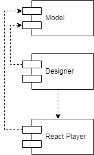

# **ART-FORMS**

Art-forms is a set of typescript packages designed for creating and completing  questionnaires. It presents two react components: "Questionnaire Designer" and "Questionnaire Player". Questionnaire designer can create or update questionnaire. Questionnaire player is designed to pass the questionnaire. Components were designed in bootstrap style, so you can easily add bootstrap themes to change there appearance. This components work with our observable models from models package, but this models are fully compatible with fhir standard. All models can be converted to fhir standard and back via fhir-converter package.

# Uml

## _Components diagram_

## _Learn more about packages_
* [designer](./packages/designer/README.md "@art-forms/designer package")
* [player](./packages/player/README.md "@art-forms/player package")
* [models](./packages/models/README.md "@art-forms/models package")
* [fhir-converter](./packages/fhir-converter/README.md "@art-forms/fhir-converter package")
* [observable](./packages/observable/README.md "@art-forms/observable package")
* [demo-app](./packages/demo-app/README.md "@art-forms/demo-app")

&nbsp;
# What does it look like
We created demo app to show you how our components can be used. To see how it works first of all clone the repository. Then you have to download all dependencies, to do it run following command in the root dir(art-forms/): 

> $ yarn

To know how to run it follow the link [README.md](https://github.com/Artezio/ART-FORMS/blob/master/packages/demo-app/README.md "@art-forms/demo-app").