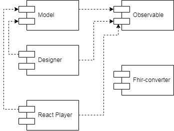

# **SURVEYBUILDER**
FHIR R4 compatibly questionnaire designer/player. If you are not familiar with medical standard FHIR R4 check out the [following refs](#interesting-references).

Surveybuilder is a set of typescript packages. It presents two react components: "Questionnaire Designer" and "Questionnaire Player". Questionnaire designer is designed to create/update questionnaires. Questionnaire player is designed to answer questionnaires. Components are designed in bootstrap style, so you can easily add bootstrap themes to change there appearance. This components work with our observable models from models package, but this models are fully compatible with FHIR R4 standard. All models can be converted to FHIR R4 standard and back via fhir-converter package. Surveybuilder can be also used in other spheres. To serialize models to another format different from FHIR R4 you must use your custom converter. See how to add your converter in section [below](#applying-custom-converter).

# Interesting references

* HL7 FHIR - http://hl7.org/fhir/
* Questionnaire FHIR model - https://www.hl7.org/fhir/questionnaire.html
* Questionnaire response FHIR model - https://www.hl7.org/fhir/questionnaireresponse.html


# Installation

Using npm:
>$ npm install @artezio/surveybuilder

Using yarn:
>$ yarn add @artezio/surveybuilder

# Usage 

Designer
```TSX
import { render } from 'react-dom';
import { Questionnaire, QuestionnaireDesigner } from '@artezio/surveybuilder';

const questionnaireModel = new Questionnaire();
render(<QuestionnaireDesigner questionnaireModel={questionnaireModel} />, document.getElementById('root'));
```

Player
```TSX
import { render } from 'react-dom';
import { QuestionnaireResponse, QuestionnairePlayer } from '@artezio/surveybuilder';

const questionnaire = { 
    title: 'My Questionnaire', 
    items: [
        { test: 'Do you smoke?', type: 'BOOLEAN' }
    ] 
};
const questionnaireResponseModel = new QuestionnaireResponse(questionnaire);
render(<QuestionnairePlayer questionnaireResponseModel={questionnaireModel} questionnaire={questionnaire} />, document.getElementById('root'));
```

Read instructions how to use packages separately in [section below](#learn-more-about-packages).

# Components diagram



# Learn more about packages
* [designer](./packages/designer/README.md "@artezio/designer package")
* [player](./packages/player/README.md "@artezio/player package")
* [models](./packages/models/README.md "@artezio/models package")
* [fhir-converter](./packages/fhir-converter/README.md "@artezio/fhir-converter package")
* [observable](./packages/observable/README.md "@artezio/observable package")
* [observable-react](./packages/observable-react/README.md)
* [demo-app](./demo-app/README.md "@artezio/demo-app")


&nbsp;
# What does it look like
We created demo app to show you how our components can be used.
* ## Demo
    https://surveybuilder.now.sh/

* ## Demo with code in sandbox
    https://codesandbox.io/s/github/Artezio/SURVEYBUILDER/tree/master/?fontsize=14&hidenavigation=1&theme=dark

* ## Launch on your computer
    First clone the repository. Then you are to download all dependencies, to do it run following command in the root dir(surveybuilder/): 

    > $ yarn

    To find out how to run it follow the link [README.md](./doc/DEMO-APP.md).


# Applying custom converter

Your custom converter must have 2 objects: questionnaire converter and questionnaire response converter. For example lets consider how they are used with fhir-converter:

```javascript
import { questionnaireConverter } from "@artezio/fhir-converter";

const questionnaireModel = {
    "id": '1',
    "title": 'Questionnaire',
    "items": [
        {
            "id": 'item_1',
            "type": 'CHOICE'
        }
    ]
};
const questionnaireFhirR4Model = questionnaireConverter.fromModel(questionnaireModel);
```

```javascript
import { questionnaireResponseConverter } from "@artezio/fhir-converter";

const responseFhirR4Model = {
    "resourceType": "QuestionnaireResponse",
    "id": "3141",
    "item": [
        {
        "linkId": "1"
        }
    ]
};
const responseModel = questionnaireResponseConverter.toModel(responseFhirR4Model);
```

Each converter must have 2 functions:

| Name | argument | Description | 
| :---- | :-------- | :----- |
| toModel | customModel | This function must receive custom mode and return model in format described below |
| fromModel | model | This function must receive model in format described below and return custom model |

Models interfaces are described in [models package](./packages/models/README.md "@artezio/models package") in "Detailed description for models" section.