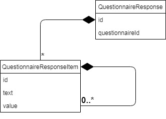

# **@artezio/models**
FHIR compatible observable models.

# Installation
Using npm:
>$ npm install -D @artezio/models

Using yarn:
>$ yarn add -D @artezio/models

&nbsp;
# Example

This models are mostly used with [designer](./../designer/README.md "@artezio/designer package") and [player](./../player/README.md "@artezio/player package") so it's enough to use it like this:
```JSX
import { Questionnaire, QuestionnaireResponse } from '@artezio/models';

const questionnaire = new Questionnaire(/*initial questionnaire in JSON format, if needed*/);
const questionnaireResponse = new QuestionnaireResponse(questionnaire, /*initial questionnaireResponse in JSON format, if needed*/);
```
Then you should pass them straight to QuestionnaireDesigner and QuestionnairePlayer components.

&nbsp;
# Diagrams

## Questionnaire


## QuestionnaireResponse



# Detailed description for models

## Table of content

* [Questionnaire model](#questionnaire-model)
    * [Item model](#item-model)
        * [Initial answer](#initial-answer)
        * [Enable When](#enable-when)
        * [Answer option](#answer-option)
* [Questionnaire response model](#questionnaire-response-model)
    * [Questionnaire response item model](#questionnaire-response-item-model)
        * [Questionnaire response item answer](#questionnaire-response-item-answer)

## Questionnaire model

| Name | required | type | Description | 
| :---- | :------ | :--- | :----- |
| id | true | string | Questionnaire identifier. Must be uniq among all questionnaires |
| title | false | string | Questionnaire title |
| description | false | string | Description for questionnaire |
| items | false | array | Each element is [Item model](#item-model) |

## Item model

| Name | required | type | Description | 
| :---- | :------ | :--- | :----- |
| id | true | string | Item identifier. Must be uniq among all Items within the questionnaire |
| type | true | string | Should be imported as variable from @artezio/models. Variable names: STRING, ATTACHMENT, OPEN_CHOICE, CHOICE, TEXT, TIME, DATE_TIME, DATE, DECIMAL, BOOLEAN, MULTI_CHOICE. |
| text | false | string | Question |
| required | false | boolean | Whether item required or not |
| enableWhen | false | array | Each element is [Enable When](#enable-when) |
 enableBehavior | false | string | Should be imported as variable from @artezio/models. Variable names are: OR, AND |
| initialAnswers | false | array | Each element is [Initial answer](#initial-answer) |
| multipleFiles | false | boolean | Specific parametr especially for attachment items; Define whether user can apply multiple files(true) or single(false) |
| options | false | array | Each element is [Answer option](#answer-option) |

## Initial answer

| Name | required | type | Description | 
| :---- | :------ | :--- | :----- |
| id | true | string | Initial answers identifier. Must be uniq within the item |
| value | false | any | Initial answers value |

## Enable when

| Name | required | type | Description | 
| :---- | :------ | :--- | :----- |
| id | true | string | EnableWhen identifier. Must be uniq within the item |
| operator | true | string | Should be imported as variable from @artezio/models. Variable names are: EXISTS, EQUAL, NOT_EQUAL, MORE, LESS, MORE_OR_EQUAL, LESS_OR_EQUAL. |
| questionId | false | string | id of the particular item |
| answer | false | any | expected answer fro particular question |

## Answer option

| Name | required | type | Description | 
| :---- | :------ | :--- | :----- |
| id | true | string | AnswerOption identifier. Must be uniq within the item |
| value | false | any | Option value |
| defaultSelected | false | boolean | Whether option must be selected by default( in items like choice and openChoice only one option should have this property set to true ) |

## Questionnaire response model

| Name | required | type | Description | 
| :---- | :------ | :--- | :----- |
| id | true | string | QuestionnaireResponse identifier. Must be uniq amon all QuestionnaireResponses |
| questionnaireId | true | string | id of particular questionnaire for which this response is referenced |
| items | false | array | Each element is [Questionnaire response item model](#questionnaire-response-item-model) |

## Questionnaire response item model

| Name | required | type | Description | 
| :---- | :------ | :--- | :----- |
| id | true | string | QuestionnaireResponseItem identifier. Must be uniq amon all QuestionnaireResponseItems within QuestionnaireResponse |
| questionId | true | string | id of particular item |
| text | false | string | Question |
| answers | false | array | Each element is [Questionnaire response answer](#questionnaire-response-answer) |

## Questionnaire response item answer

| Name | required | type | Description | 
| :---- | :------ | :--- | :----- |
| id | true | string | id must be uniq within QuestionnaireResponseItem |
| value | false | any | Answer value |
| items | false | array | Each element is [Questionnaire response item model](#questionnaire-response-item-model) |